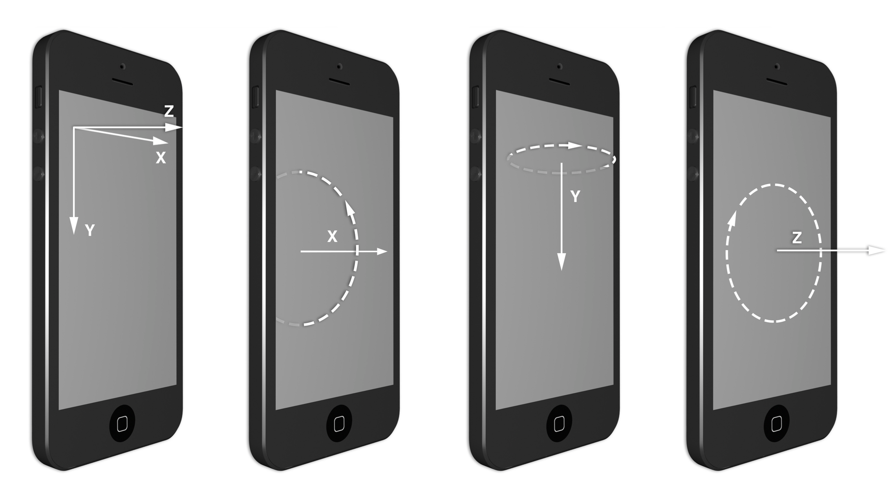
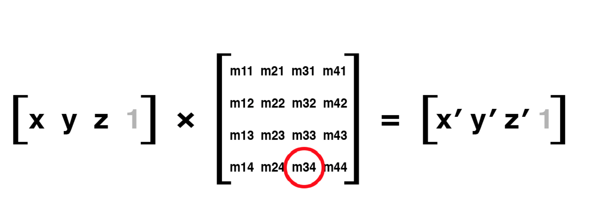

# iOS Core Animation
## iOS Core Animation Advanced Techniques
### 图层树
* CALayer没有暴露给UIView的特性
	* 阴影，圆角边框，边框颜色
	* 3D变换和位置变换
	* 不规则边界
	* 内容的alpha掩码
	* 多阶段非线性动画
* 图层树是UIKit的基础，表示了你在iOS应用中在屏幕上看到的所有内容

### 寄宿图
* ` layer.content = (__bridge id)image.CGImage `
* CALayer的**contentsScale**属性是支持高清屏机制的一部分。它决定了由layer自动创建图片的尺寸和显示图片内容的缩放。该值默认是1.0，表示采用每个像素一个点。如果是2.0表示每个像素两个点（高清屏），像素时物理单位，点是虚拟单位。对于CGImage，其内部没有缩放的概念。UIImage是有这个概念的。当我们采用*kCAGravityResizeAspect*时，图片会缩放适配layer，因此这个概念不起作用。` layer.contentScale = [UIScreen mainScreen].scale `
* **masksToBounds**用来去掉超出layer的内容部分
* **contentsRect**属性可以用来描述图片在layer区域内显示的子矩形区域。即可以将图层的内容裁剪显示。
* contentsCenter属性是一个用来定义在layer内缩放区域以及边界不变区域的矩形。默认是{0, 0, 1, 1}，即随着layer做拉伸。**通常用于小图拉大图**。
* UIView没有提供默认的**-drawRect:**实现，如果检测到有提供**-drawRect:**，会申请一个视图大小的区域乘以*contentsScale*空间。对于通过contents设置图片或给背景设置一个固定的颜色是不需要一个可定制的寄宿图的，因此也就不需要实现**-drawRect:**。如果没有必要，只会浪费内存和CPU时间。
* 在视图第一次显示在屏幕上时，*drawRect*会被调用，在这个函数中，可以使用Core Graphics在寄宿图上绘制，结果会被缓存起来直到需要被更新（如调用*setNeedDisplay*）
* CALayer有一个**delegate**属性，用来向layer提供内容信息。
* **- (void)displayLayer:(CALayerCALayer *)layer;**当需要重绘时，可以通过这个接口来设置它的*contents*，然后就不会调别的接口了。如果没有实现这个接口会调用**- (void)drawLayer:(CALayer *)layer inContext:(CGContextRef)ctx;**在调用这个接口前，CALayer会创建一个空的合适大小的图用于在上面绘制
* 对于使用了代理的layer，需要用户手动调用**display**来更新；另外，*masksToBounds*属性默认会enable，因为绘制的上下文限定了绘制区域
* 当使用视图的layer时，没必要实现*-displayLayer:*或*-drawLayer:inContext:*在图层的寄宿图上绘制；只需实现*-drawRect:* ，UIView会处理好这一切，包括在需要的时候调用-display

### 图层几何学
* **frame**表示layer在外部的坐标，即它在父layer中占的空间；bounds表示内部坐标，｛0，0｝表示的是左上角，position表示的是与父layer相关的一个锚点
* 当操作view的*frame*，*bounds*和*center*时，实际是在操作layer的对应的属性
* **frame**是个虚拟属性，它是通过*bounds*，*position*和*transform*计算而成，对这些属性的改变会影响到*frame*，同理，修改*frame*也会影响到这些属性
* **anchorPoint**即锚点，是用来移动layer的句柄。它控制layer的*frame*位置，默认下，锚点位于layer的中心。锚点的作用主要是用在对layer做变换时使用，起到支点的作用，如以这点为支点进行旋转点，缩放点，平移点等
* **position**是layer中*anchorPosition*点在父layer中的位置坐标，因此*position*点是相对父layer的，*anchorPoint*是相对layer的，两者是相对不同的坐标空间的一个重合点。*position*是根据*anchorPoint*来确定的。
* **anchorPoint**的默认值是（0.5，0.5），也是*anchorPoint*默认在layer的中心点。使用*addSublayer*函数添加layer时，如果已知layer的*frame*值，*position*值可以计算如下：

```
position.x = frame.origin.x + 0.5 * bounds.size.width;
position.y = frame.origin.y + 0.5 * bounds.size.height;
```

这个中间的0.5是因为*anchorPoint*取默认值，更通用的公式是：

```
position.x = frame.origin.x + anchorPoint.x * bounds.size.width;
position.y = frame.origin.y + anchorPoint.y * bounds.size.height;
```

如果单方面修改layer的*position*位置不会对*anchorPosition*产生影响，同理，如果修改*anchorPosition*也不会影响*position*；受影响的只是*frame.origin*，即layer相对与父layer的坐标原点

```
frame.origin.x = position.x - anchorPosition.x * bounds.size.width;
frame.origin.y = position.y - chanorPosition.y * bounds.size.height;
```

这就是为什么修改*anchorPoint*会移动layer，因为*position*不受影响，只能是*frame.origin*做相应的改变，因而会移动layer

* 更多关于frame，anchorPoint和postion的参考如下：
> [anchorPoint, frame, positon](http://wonderffee.github.io/blog/2013/10/13/understand-anchorpoint-and-position/)

* CALayer提供了在不同layer之间转换坐标系的接口

```
- (CGPoint)convertPoint:(CGPoint)point fromLayer:(CALayer *)layer; 
- (CGPoint)convertPoint:(CGPoint)point toLayer:(CALayer *)layer; 
- (CGRect)convertRect:(CGRect)rect fromLayer:(CALayer *)layer;
- (CGRect)convertRect:(CGRect)rect toLayer:(CALayer *)layer;
```

* 坐标系翻转，对于iOS而言，设置某个layer的*geometryFlipped*为YES意味着它的父layer的坐标系将会垂直翻转，这个翻转会一直影响到它的所有子layer，直到某个*geometryFlipped*的设为YES
* UIView是二维的，CALayer是三维的。用*zPosition*可以改变layer的显示顺序
* 通过*-containsPoint:* and *-hitTest:*来判断某个点是否在在指定的layer中，**注意在layer的顺序**
* CALayer没有自动布局，对于需要动态调整layer大小的情况，可以通过*CALayerDelegate*的*- (void)layoutSublayersOfLayer:(CALayer *)layer;*接口实现，当layer的*bounds*改变或者*-setNeedsLayout*被调用的时候，这个接口会被调用，让你有机会重新布局或改变所有相关layer的大小

### 可视效果
* 圆角**cornerRadius**，默认情况下，这个圆角只会影响layer的背景色，不会影响laye的图片和子layer，如果*masksToBounds*为YES的话，所有layer里面的内容都会收到影响
* layer的边缘线**borderWidth**和**borderColor**，该边缘线绘制在边界内，该内容层最上层，高于子layer。layer的边缘线不会考虑layer的内容或者子图层
* 向下的阴影，用来表示视图的深度，*shadowOpacity*，*shadowColor*，*shadowOffset*，*shadowRadius*，*shadowRadius*
* layer的阴影考虑的图形的内容
* **mask**属性，定义了他的父图层的可见区域；*mask*的颜色被忽略了，它只关心轮廓
* 缩放过滤，当一幅图片需要显示不同的尺寸时，一个算法（缩放过滤）会应用到图片上，实际像素映射到显示的像素上
* **minificationFilter**表示压缩显示，**magnificationFilter**表示放大显示，默认的算法都是*kCAFilterLinear*，对于没有斜线显示的小图，*kCAFilterNearest*效果最好
* 对于透明度，用*opacity*，这个透明度会影响自己layer和所有子layer，如果想让所有的子图层有一致的显示效果，可以使用**shouldRasterize**，它让layer和子layer在应用opaity前融合，另外需要调整**rasterizationScale**

### 变换
* 仿射变换，是二维变换，仿射的含义是对于平行的边在变换后仍然保持平行
* 创建一个仿射矩阵

```
CGAffineTransformMakeRotation(CGFloat angle)
CGAffineTransformMakeScale(CGFloat sx, CGFloat sy) 
CGAffineTransformMakeTranslation(CGFloat tx, CGFloat ty)
```

例如：

```
//rotate the layer 45 degrees
CGAffineTransform transform = CGAffineTransformMakeRotation(M_PI_4);
self.layerView.layer.affineTransform = transform;
```

* 在一个已有的变换上继续变换

```
CGAffineTransformRotate(CGAffineTransform t, CGFloat angle) 
CGAffineTransformScale(CGAffineTransform t, CGFloat sx, CGFloat sy) 
CGAffineTransformTranslate(CGAffineTransform t, CGFloat tx, CGFloat ty)
```

* 常量矩阵 CGAffineTransformIdentity
* 将两个矩阵连接成一个新的矩阵
`CGAffineTransformConcat(CGAffineTransform t1, CGAffineTransform t2);`
* **对于连续的变换，后面的矩阵受到前面变换矩阵的影响**，如先缩放50%，再旋转30度，再平移200，实际上该layer会跑到它的右下角去。因为200的平移是先缩小50%，再旋转了30度的结果
* 斜切变换

```
CGAffineTransform CGAffineTransformMakeShear(CGFloat x, CGFloat y) {
	CGAffineTransform transform = CGAffineTransformIdentity; transform.c = -x;
	transform.b = y;
	return transform;
}
- (void)viewDidLoad {
	[super viewDidLoad];
	//shear the layer at a 45-degree angle
	self.layerView.layer.affineTransform = CGAffineTransformMakeShear(1, 0); 
}
```

#### 3D变换
* layer的**transform**属性是**CATransform3D**类型
* 创建3D变换矩阵

```
CATransform3DMakeRotation(CGFloat angle, CGFloat x, CGFloat y, CGFloat z) 
CATransform3DMakeScale(CGFloat sx, CGFloat sy, CGFloat sz) 
CATransform3DMakeTranslation(Gloat tx, CGFloat ty, CGFloat tz)
```

*旋转满足左手定理

* 投射视角，为了让我们感觉到远的东西比进的东西小一些，我们需要调整视角变换，即z变换，调整的参数如图m34
 
默认条件下，m34为0，我们可以设置该值为-1.0/d，这个d表示的是想象的照相机到屏幕的距离，通常可以设置再500到1000之间
* **sublayerTransform**，对于所有的子图层，可以通过设置这个值来统一所有子layer的视角
* **doubleSided**用来控制是否显示双面

### 特殊的图层
#### CAShapeLayer
* 使用矢量图形而不是位图，通过颜色和线宽属性来定义一个CGPath，CAShapeLayer会自动渲染它
* 特点
	* 快速，使用硬件加速来绘制
	* 内存空间省
	* 可以再边界外面绘制
	* 没有像素化
* 通过它可以实现可定制圆角
//define path parameters
CGRect rect = CGRectMake(50, 50, 100, 100); 
CGSize radii = CGSizeMake(20, 20); 
UIRectCorner corners = UIRectCornerTopRight |
		    UIRectCornerBottomRight | 
		     UIRectCornerBottomLeft;
//create path
UIBezierPath *path = [UIBezierPath bezierPathWithRoundedRect:rect byRoundingCorners:corners cornerRadii:radii];

#### CATextLayer
* CATextLayer渲染比UILabel快
* rich text

#### CATransformLayer

#### CGGradientLayer
* 用于生产平滑过度的颜色渐变

#### CAReplicatorLayer
* 用于高效生产一组相似的layer

#### CAScrollLayer

#### CATiledLayer
* 逐块显示

#### CAEmitterLayer
* 显示离子或火焰等效果

#### AVPlayerLayer
